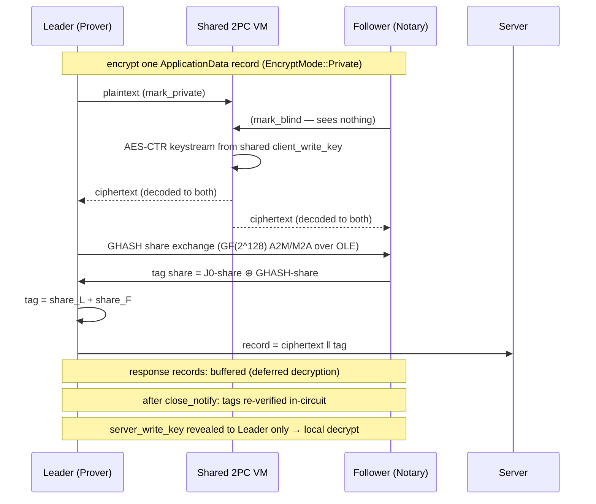

# TLSNotary proof generation: a deep dive

This document traces the complete proof generation flow — **prove → present →
verify** — as implemented in this repository, anchored to the three example
programs in `crates/examples/attestation/` (`prove.rs`, `present.rs`,
`verify.rs`). The goal is not just to describe what each step does, but to make
clear *why* it is designed the way it is: what breaks if you remove or relax
each piece.

Everything below was verified by reading the source at the referenced paths
unless explicitly marked **[inferred]** or **[general construction, not
verified in this repo]**. Line numbers refer to the tree at the time of
writing and will drift.

---

## 1. Overview and threat model

Three parties participate:

- **Prover** (the MPC-TLS *leader*, `MpcTlsLeader` in
  `crates/mpc-tls/src/leader.rs`): wants to prove that specific data was
  exchanged with a TLS server, without revealing all of it.
- **Verifier / Notary** (the *follower*, `MpcTlsFollower` in
  `crates/mpc-tls/src/follower.rs`): co-executes the TLS session and either
  verifies the transcript directly or — in the notary role used in these
  examples — signs a portable `Attestation` over commitments to it.
- **Server**: an ordinary TLS 1.2 server. It participates unknowingly; it sees
  a completely standard TLS client.

The core design constraint, and the reason all of the MPC machinery exists:

> **The Notary must be able to attest to data it never sees, and the Prover
> must be unable to forge data the Notary co-computed.**

TLS by itself gives you neither half of this. TLS records are authenticated
with *symmetric* keys (AES-GCM), so anyone who holds the session keys — which
includes the client, i.e. the Prover — can fabricate an arbitrary "transcript"
after the fact. TLS has confidentiality and integrity *between the two
endpoints*, but no transferable, third-party-checkable authenticity. TLSNotary
repairs this by ensuring the Prover **never unilaterally holds the session
keys while the session is live**: the keys exist only as 2-of-2 secret shares
between Prover and Verifier, and every encryption and MAC is computed jointly
in secure two-party computation (2PC).

Trust assumptions, per party:

- The **Verifier/Notary** is trusted by downstream consumers of the
  attestation *only* to have executed its half of the protocol honestly — it
  is explicitly **not** trusted with the plaintext, the session keys, or even
  (in this design) the server's name; it never receives any of them. A
  malicious Notary colluding with the Prover can of course sign anything —
  attestation consumers choose which Notary keys they trust
  (`crates/attestation/src/lib.rs`, and the "do you trust this key?" prompt in
  `verify.rs:60-63`).
- The **Prover** is untrusted. The protocol must remain sound against a
  malicious Prover trying to forge transcript contents: this is enforced by
  the DEAP dual-VM check (§2), the dual-PMS equality check (§3), leader-only
  tag reconstruction plus post-hoc in-circuit tag verification (§4), and the
  ZK consistency proofs between committed plaintext and the authenticated
  ciphertext (§5).
- The **Server** is trusted exactly as much as in ordinary TLS: its
  certificate chain authenticates its identity, and its handshake signature
  binds its ephemeral key to that identity. The server is *oblivious* — the
  protocol is deliberately indistinguishable, from the server's viewpoint,
  from a normal TLS client (§3).

The whole flow, end to end:

```mermaid
sequenceDiagram
    participant P as Prover (leader)
    participant N as Notary/Verifier (follower)
    participant S as TLS Server
    participant V as Presentation Verifier

    Note over P,N: Phase 1 — setup & preprocessing
    P->>N: TlsCommitRequestMsg (MpcTlsConfig: max_sent/max_recv)
    N-->>P: accept
    P->>N: OT extension, garbling, OLE preprocessing (Ferret/KOS)

    Note over P,S: Phase 2 — three-party handshake
    P->>S: ClientHello, client_pub = leader_pub + follower_pub
    S-->>P: cert chain, sig over ephemeral key
    P->>N: EC point-addition share conversion (A2M/M2A over P-256)
    Note over P,N: PMS additively shared; session keys exist only as 2PC shares

    Note over P,S: Phase 3 — 2PC record layer
    P->>N: joint AES-CTR + GHASH share exchange per record
    P->>S: encrypted HTTP request
    S-->>P: encrypted HTTP response (buffered, deferred decryption)
    Note over P,N: close_notify; tags verified in-circuit; ciphertext transcript authenticated
    N-->>P: server_write_key revealed to Prover only → local decryption

    Note over P,N: Phase 4 — commitment & attestation
    P->>N: ProveRequestMsg (reveal ranges, commit ranges)
    P->>N: ZK proof: committed plaintext ⊕ keystream = authentic ciphertext
    P->>N: AttestationRequest (cert commitment, transcript commitments)
    N-->>P: signed Attestation (Merkle root of body fields, ECDSA over header)

    Note over P,V: Phase 5 — presentation (offline, any time later)
    P->>V: Presentation = AttestationProof + ServerIdentityProof + TranscriptProof

    Note over V: Phase 6 — verification
    V->>V: notary signature → cert chain (webpki) → hash openings
```

---

## 2. Phase 1: Setup and preprocessing

The example begins by opening a session with the Notary and calling `commit`
with pre-declared traffic limits:

```rust
// crates/examples/attestation/prove.rs — prover()
let prover = handle
    .new_prover(ProverConfig::builder().build()?)?
    .commit(
        // We must configure the amount of data we expect to exchange beforehand,
        // which will be preprocessed prior to the connection. Reducing these
        // limits will improve performance.
        MpcTlsConfig::builder()
            .max_sent_data(tlsn_examples::MAX_SENT_DATA)   // 1 << 12
            .max_recv_data(tlsn_examples::MAX_RECV_DATA)   // 1 << 14
            .build()?,
    )
    .await?;
```

`Prover::commit` (`crates/tlsn/src/prover.rs:94`) first performs a
compatibility handshake with the Verifier (`TlsCommitRequestMsg`,
`prover.rs:104-129`), then builds `ProverDeps` and runs `deps.setup().await`
(`prover.rs:132-133`). `ProverMpcDeps::new`
(`crates/tlsn/src/deps/prover.rs:53`) assembles the entire cryptographic
stack:

- **The OT stack**: Chou–Orlandi base OT → KOS OT extension → **Ferret**
  (LPN-based "silent" correlated OT), wrapped in shared
  RCOT senders/receivers (`deps/prover.rs:57-72`).
- **Two virtual machines**, composed by
  `Deap::new(Role::Leader, mpc, zk)` (`deps/prover.rs:89`):
  a semi-honest garbled-circuit VM (`mpz_garble::protocol::semihonest::
  {Garbler, Evaluator}`) and a ZK VM (`mpz_zk::{Prover, Verifier}`).

**DEAP** — *"Dual-execution with Asymmetric Privacy"*
(`crates/components/deap/src/lib.rs:1`) — is the malicious-security wrapper
that makes cheap semi-honest garbling safe against a malicious Prover.
`Deap<Mpc, Zk>` (`lib.rs:33`) mirrors every allocation and circuit call into
*both* VMs via a `MemoryMap`, but during the live session **only the MPC VM
executes** (`lib.rs:369-372`: *"Only MPC VM is executed until
finalization."*). At `Deap::finalize` (`lib.rs:108`) the same computation is
re-proven in the ZK VM, and the follower asserts `zk_output == mpc_output`
for every decoded output (`lib.rs:148-165`, `ErrorRepr::EqualityCheck`). A
leader that used inconsistent inputs in the two VMs is caught
(`test_malicious`, `lib.rs:551`). The asymmetry is deliberate: the *leader's*
privacy is protected unconditionally by the garbling, while the *follower's*
inputs are only committed at finalization (`lib.rs:267-273`) — acceptable
because the follower's secrets (its key shares) are *supposed* to be revealed
once the transcript is fixed.

### Why the sizes must be pre-declared

`MpcTlsLeader::alloc` (`crates/mpc-tls/src/leader.rs:116`) →
`alloc_session` (`crates/mpc-tls/src/utils.rs:45`) allocates the key
exchange, the PRF, and the record layer:

```rust
// crates/mpc-tls/src/utils.rs — alloc_session()
record_layer.alloc(vm, config.max_sent_records, config.max_recv_records_online,
                   config.max_sent, config.max_recv_online, config.max_recv)
```

Inside `MpcAesGcm::alloc`
(`crates/mpc-tls/src/record_layer/aead/aes_gcm.rs:85`) these numbers become
concrete circuit wires: one J0 counter block *per record* (line 106), and a
`vm.alloc_vec::<U8>(len)` for the payload, rounded up to 16-byte AES blocks
(lines 116-118), marked `mark_private` on the leader and `mark_blind` on the
follower. Garbled-circuit 2PC has no dynamic memory: every wire, every OT,
and every one-time pad must exist before execution. Exceeding the budget is a
hard runtime error (`record_layer.rs:295-300`: *"increase `max_sent` in the
config"*).

Pre-declaration buys two things:

1. **The expensive work moves off the critical path.**
   `MpcTlsLeader::preprocess` (`leader.rs:150`) runs key-exchange setup, the
   record layer's GHASH OLEs, and VM preprocessing (garbling + OT extension)
   in parallel (`ctx.try_join3`, `leader.rs:173`) — *before* the TCP
   connection to the server is even opened. The online phase, which happens
   while a real TLS peer is waiting, only evaluates already-garbled circuits.
2. **The follower's resource exposure is bounded.** The leader cannot force
   the follower to allocate unbounded memory: `MAX_BUFFER_SIZE` /
   `MAX_RECORD_SIZE` (`record_layer.rs:35-37`) and the declared limits cap
   everything up front.

The flip side is UX: a request that exceeds `MAX_RECV_DATA` cannot be
notarized without re-running setup, which is why the examples set the limits
explicitly and why the SDK logs transcript size against the configured
maximum at session end (commit `2803ee4`).

---

## 3. Phase 2: The three-party handshake

Code: `crates/components/key-exchange/src/{exchange.rs, point_addition.rs,
circuit.rs}`, driven from `crates/mpc-tls/src/leader.rs` /
`follower.rs`. The crate docs link the protocol spec at
<https://tlsnotary.org/docs/mpc/key_exchange> (`lib.rs:11`).

### The key-share math

The "TLS client" is really the Prover and Verifier acting jointly. Each party
samples an independent P-256 ephemeral secret (`SecretKey::random`,
`exchange.rs:101`). The ClientKeyExchange contains the **sum of the two
public keys**:

```rust
// crates/components/key-exchange/src/exchange.rs — MpcKeyExchange::client_key()
client_pub = leader_pub + follower_pub   // EC point addition
```

The server computes standard ECDH against this combined key:

```text
Z = d_S · (leader_pub + follower_pub) = d_S·G·d_L + d_S·G·d_F = P₁ + P₂
```

so each party can *locally* compute its own point: the leader computes
`P₁ = d_L · server_pub`, the follower `P₂ = d_F · server_pub`
(`compute_ec_shares`, `exchange.rs:438-441`). The TLS pre-master secret (PMS)
is the x-coordinate of `P₁ + P₂` — but naive point addition would require
one party to learn the other's point. Instead, `derive_x_coord_share`
(`point_addition.rs:16-73`) converts the addition into **additive shares of
the x-coordinate alone**, using the affine addition formula
`x = λ² − x₁ − x₂` with `λ = (y₂−y₁)/(x₂−x₁)`:

1. Leader inputs `[y₁, x₁]`; follower inputs `[−y₂, −x₂]` — additively these
   encode `(y₁−y₂)` and `(x₁−x₂)` (`point_addition.rs:30-33`).
2. `queue_to_multiplicative` (A2M) converts to multiplicative shares; each
   party locally computes `c = a·b⁻¹` and squares it, so that
   `c_L · c_F = λ²` (`point_addition.rs:44-54`).
3. `queue_to_additive` (M2A) converts back: `d_L + d_F = λ²`
   (`point_addition.rs:56-68`).
4. Each party outputs `x_i = d_i − x_own`; summing gives
   `λ² − x₁ − x₂ = x`. ✓

The share-conversion primitive is **OLE over oblivious transfer** — *not*
Paillier: the converters are `mpz_share_conversion::{ShareConversionSender,
ShareConversionReceiver}` built on `mpz_ole::{OLESender, OLEReceiver}` over
randomized correlated OT (`crates/mpc-tls/src/leader.rs:64-77`), over the
field `mpz_fields::p256::P256`.

### Malicious security: the dual-PMS check

`point_addition.rs:4` is explicit that the sub-protocol alone *"has
semi-honest security"*. The construction hardens it by running the entire
share conversion **twice** with independent converters, yielding two
independent sharings `pms_0`, `pms_1` of the same x-coordinate
(`exchange.rs:129`). Both are then reconstructed *inside the garbled
circuit* — `build_pms_circuit` (`circuit.rs:20-75`) adds the shares
`mod P` (the P-256 field prime, `exchange.rs:28-31`) and outputs
`EQ = PMS₀ XOR PMS₁`. `finalize` (`exchange.rs:402-417`) requires
`eq == [0u8; 32]`, else the protocol aborts with `"PMS values not equal"`.
A party that cheated in one conversion produces disagreeing sharings and is
caught (`test_malicious_key_exchange`, `exchange.rs:634`).

### Why the server can't tell

The server receives a single, valid P-256 point in a standard
ClientKeyExchange (`leader.rs:250-257`, sent through the rustls-derived
client in `crates/mpc-tls/src/client/`), performs ordinary ECDH, and gets an
ordinary TLS 1.2 handshake. Nothing on the wire distinguishes a
secret-shared client key from a normal one — a fresh ECDHE key is a uniformly
random point either way. This is what makes TLSNotary deployable against
unmodified servers, and it is also a design commitment: any variant that
required server cooperation would collapse the use case (proving data from
services that have no incentive to help).

### From shared PMS to shared session keys

The PMS is never reconstructed in the clear — it exists as `Pms =
Array<U8, 32>` inside the shared VM. The TLS 1.2 PRF
(`crates/components/hmac-sha256`, doc: *"the protocol for computing TLS 1.2
SHA-256 HMAC PRF"*, `lib.rs:1`) runs inside 2PC over that value, producing
`SessionKeys { client_write_key, server_write_key, client_iv, server_iv }`
(`lib.rs:33-44`) and the Finished verify-data. Every one of these is a
2PC value: **neither party ever holds a complete write key** during the
session. Only TLS 1.2 is supported in this version.

---

## 4. Phase 3: The 2PC record layer

Code: `crates/mpc-tls/src/record_layer.rs` and
`record_layer/aead/{aes_gcm.rs, ghash.rs, encrypt.rs, decrypt.rs}`, plus the
2PC AES circuits in `crates/components/cipher/src/aes/mod.rs`.

This is the crux of the design: **the Notary co-computes every ciphertext
without ever seeing plaintext.** Because producing a valid AES-GCM record
requires the follower's key share, the Prover cannot fabricate even a single
record — yet because the plaintext enters the circuits only as the leader's
private input, the follower learns nothing about content.



### What runs where

The VM never evaluates "AES-GCM" as one circuit. It evaluates exactly two AES
components: `AES128_KS` (the key schedule) and `AES128_POST_KS` (a single
block given the schedule), used in ECB mode for `H` and `J0` and in CTR mode
for keystream (`crates/components/cipher/src/aes/mod.rs:30-69`). XORing
keystream into data uses a dedicated `xor` circuit
(`cipher/src/lib.rs:151`) — essentially free under free-XOR-style garbling
**[general construction; the garbling scheme internals live in `mpz-garble`,
not this repo]**. Everything else — GHASH polynomial evaluation, tag
assembly — happens *outside* the circuits, on additive shares.

Only `ContentType::ApplicationData` is treated as private
(`record_layer.rs:310, 352`); handshake and alert records use public modes.
The comment at `record_layer.rs:302-309` notes mislabeling *"can only hurt
the leader itself"*, and `check_close_notify` rejects a hidden closing alert.

### Encryption of the request

`encrypt.rs::private` (`record_layer/aead/encrypt.rs:20`): the leader assigns
plaintext into its `mark_private` vector, the CTR circuit produces
keystream from the shared `client_write_key`, and the resulting **ciphertext
is decoded to both parties** (`vm.decode(ciphertext)`, line 43). This is the
key asymmetry: the follower observes and co-signs (via its key share) every
ciphertext byte on the wire, while the plaintext stays inside the garbling.

### GHASH and the tag: share conversion, not circuits

Computing GHASH inside a circuit would be brutal (128-bit carry-less
polynomial arithmetic per block). Instead, the GHASH key `H = AES_k(0)` is
computed once in-circuit and immediately **additively secret-shared out of
the VM** via a one-time pad (`aes_gcm.rs:95-111`, `OneTimePadShared`). From
then on, `MpcGhash` (`record_layer/aead/ghash.rs:78`) works over
`mpz_fields::Gf2_128` shares:

```rust
// crates/mpc-tls/src/record_layer/aead/ghash.rs (comment, lines 84-87)
// Odd powers are computed using M2A, even powers are computed locally...
// Both M2A and A2M, each require a single OLE.
```

Shares of the odd powers `H³ … H¹⁰²⁵` (`MAX_POWER = 1026`,
`ghash.rs:154-164`) are precomputed during preprocessing; even powers come
free by local squaring in GF(2¹²⁸) (a linear operation). Per record, each
party locally folds the ciphertext blocks against its H-power shares
(`ghash.rs:190`), and the tag is `TagShare = J0-share ⊕ GHASH-share`
(`ghash/compute.rs:78-81`). The **follower sends its shares; only the leader
reconstructs the real tag** (`compute.rs:86-111`) and, on receive,
only the leader compares (`verify.rs:97-98`). As the code notes:
*"Ciphertexts are only authenticated from the leader's perspective"*
(`aes_gcm.rs:382`) — the follower's assurance comes later (below).

### Decryption of the response: deferred by default

With `defer_decryption = true` (the default,
`crates/mpc-tls/src/config.rs:43`), incoming ApplicationData is **not
decrypted online at all** — `flush` skips those ops
(`record_layer.rs:429-440`); the records are buffered. When the connection
closes, `RecordLayer::commit` (`record_layer.rs:547`) does two things in
order:

1. Tag/transcript fixing: the full ciphertext transcript, as observed by
   *both* parties, is now immutable.
2. `decode_key` (`aes_gcm.rs:106`) **reveals the server-write key and IV to
   the leader only** (unmasking a one-time pad), after which the leader
   decrypts locally with a plain `Aes128Gcm` (`decrypt.rs:96`,
   `aes_gcm.rs:181`) — *"decrypted for free"* (`config.rs:56-58`), with zero
   MPC cost.

An online path exists for the fraction of data a Prover must react to
mid-session (`max_recv_online`): there the keystream is decoded masked by a
follower one-time pad so that **only the leader** recovers plaintext
(`decrypt.rs::private_mpc`, `DecryptPrivate::try_decrypt`,
`decrypt.rs:236-256`); the follower's copy is `None`.

### Closing the loop: how the follower ends up convinced

At this point the follower holds ciphertexts and tags it co-computed, but the
received records are, in the code's words, *"unauthenticated from the
follower's perspective"* (`record_layer.rs:545`). Two post-session steps fix
that:

- **In-circuit tag verification**: `verify_tags` (`crates/tlsn/src/tag.rs:25`,
  called from `Prover::finish` at `prover.rs:355` and from the verifier at
  `verifier.rs:255, 363`) re-computes every record's J0 and GHASH **inside
  the VM** from the shared key/IV/MAC-key wires and proves the results match
  the actual tags of the wire transcript. After this, the ciphertext
  transcript is authenticated for the verifier.
- **DEAP finalization** (§2): every output the MPC VM produced during the
  live session is re-proven in the ZK VM (`Deap::finalize`,
  `deap/src/lib.rs:108`), converting semi-honest garbling into a
  malicious-secure result after the fact.

The ordering is the security argument: the follower's key share is never
revealed, and the leader gets the decryption key only *after* the ciphertext
transcript is fixed and co-authenticated. A Prover who wants to lie about
plaintext now has to lie inside a ZK proof about AES itself (§5) — there is
no earlier point where forgery was possible, because it never held the keys.

---

## 5. Phase 4: Commitment and attestation

### Committing to the transcript

Back in the example, the Prover parses the HTTP transcript and commits to its
parts:

```rust
// crates/examples/attestation/prove.rs — prover()
let mut builder = TranscriptCommitConfig::builder(prover.transcript());
DefaultHttpCommitter::default().commit_transcript(&mut builder, &transcript)?;
let transcript_commit = builder.build()?;
```

`DefaultHttpCommitter` (`crates/formats/src/http/commit.rs:412`) commits at
HTTP granularity — whole message, structure-without-data, request target,
each header, each header-without-value, body, and JSON fields individually —
precisely so that Phase 5 can later reveal at that same granularity.

The commitment scheme is deliberately simple. `TranscriptCommitmentKind`
(`crates/core/src/transcript/commit.rs:19`) currently has **one variant**:
`Hash { alg }`, defaulting to BLAKE3 (`commit.rs:101`). A commitment to a
span is a salted hash:

```rust
// crates/core/src/transcript/hash.rs — hash_plaintext()
// "By convention, plaintext is hashed as `H(msg | blinder)`"
```

with a 16-byte random `Blinder` (`hash.rs:243`). Each committed span is an
*independent* salted hash — there is **no Merkle tree over transcript
commitments** (the Merkle machinery in `crates/core/src/merkle.rs` is used
for attestation body fields, §5.3). The public side is
`PlaintextHash { direction, idx, hash }`; the opening is
`PlaintextHashSecret { direction, idx, alg, blinder }` (`hash.rs:22-33`).
Earlier TLSNotary versions also supported commitments derived from
garbled-circuit encodings; that path does not exist in this version — the
enums are `#[non_exhaustive]` to leave room for it.

### `prover.prove()` — binding commitments to the authentic ciphertext

A salted hash proves nothing by itself; the Prover could hash fiction. The
binding to reality happens inside `Prover::prove`
(`crates/tlsn/src/prover.rs:527`) / `Verifier::verify`
(`crates/tlsn/src/verifier.rs:419`), in the ZK VM:

1. `prove_plaintext` (`crates/tlsn/src/transcript_internal/auth.rs:20`)
   allocates the claimed plaintext for each committed/revealed range as
   private ZK inputs, runs the AES-CTR circuits over the (already
   authenticated) session key wires, and **decodes the resulting ciphertext
   for comparison against the real TLS records**
   (`ProofInner::WithZk`, `auth.rs:374-385`). For fully-revealed ranges the
   verifier instead just recomputes AES-CTR itself
   (`verify_plaintext_with_key`, `auth.rs:420`). Either way: *claimed
   plaintext ⊕ keystream must equal the wire ciphertext*.
2. `prove_hash` (`crates/tlsn/src/transcript_internal/commit/hash.rs:64`)
   computes `H(msg | blinder)` **in-circuit** (via `mpz_hash`
   Sha256/Blake3/Keccak256) over those same plaintext wires, with the blinder
   as a private input, and decodes the digest.

So what the Verifier learns from `verify()`
(`crates/tlsn/src/verifier/verify.rs:22`) before calling `.accept()` is
exactly: "these hash values are salted hashes of *the true plaintext* of
these ciphertext ranges of *this authenticated TLS session*" — without
learning a byte of the unrevealed plaintext. That sentence is the concrete
meaning of "the Notary validates commitments against jointly-computed TLS
data". The verifier also checks the server certificate data if disclosed
(`verify.rs:65-84` — not used in the notary flow, where the cert stays
hidden).

### The attestation

The Prover assembles an `AttestationRequest` from the request config, the
handshake data, and the commitment outputs (`prove.rs:226-244`), and ships it
to the Notary, who builds and signs the attestation
(`prove.rs:363-384`).

`Attestation` (`crates/attestation/src/lib.rs:437-445`) is:

```text
Attestation
├── signature  — Notary's signature (secp256k1 ECDSA in the example)
├── header     — { id: Uid (16 random bytes), version, root: TypedHash }
└── body       — the fields, each wrapped in Field<T> { id, data }:
    ├── verifying_key            — the Notary's own key
    ├── connection_info          — time, TLS version, transcript lengths
    ├── server_ephemeral_key     — the server's ephemeral ECDH key
    ├── cert_commitment          — hash commitment to HandshakeData
    ├── extensions               — application-defined, off by default
    └── transcript_commitments   — the PlaintextHash commitments
```

The signature does **not** cover the body directly. `Body::hash_fields`
(`lib.rs:378-413`) hashes each field with a domain separator (*"to mitigate
type confusion attacks"*), the hashes become leaves of a `MerkleTree` whose
root goes into the header (`lib.rs:359-368`), and the Notary signs the
canonical serialization of the **header only**
(`builder.rs:178-180`). This indirection is what later lets a presentation
prove selected body fields against the signed root.

**What is deliberately absent** — and this is the point of the design:

- **No plaintext.** Only salted-hash commitments.
- **No session keys.** They never existed in either party's hands.
- **No server name, no certificate chain, no server signature.** The Notary
  holds only `server_ephemeral_key` and a *commitment* to the handshake
  data. As `crates/attestation/src/connection.rs:1-20` explains, the
  ephemeral key *"serves as a binding commitment to the identity of the
  Server"* without revealing it; withholding the chain improves *"privacy
  and censorship resistance"* — the Notary cannot even selectively refuse to
  notarize particular websites, because it does not know which website it is
  attesting to.

On receipt, the Prover runs `Request::validate`
(`crates/attestation/src/request.rs:47-102`; `prove.rs:264`), checking that
the Notary used the requested algorithms, embedded the *same* cert commitment
the Prover computed, included the requested extensions, and produced a valid
signature over the header. The Prover then persists two artifacts: the
`Attestation` and the `Secrets`
(`crates/attestation/src/secrets.rs:11-18`): the server name, the blinded
cert opening, the full transcript, and all commitment secrets (blinders). The
`Secrets` type is `opaque_debug` — it never travels to anyone.

---

## 6. Phase 5: Presentation — selective disclosure

`present.rs` runs entirely offline, any time later, with no Notary
involvement. The concrete redaction example from the code — hiding the
`Authorization` header value while proving everything around it:

```rust
// crates/examples/attestation/present.rs — create_presentation()
let mut builder = secrets.transcript_proof_builder();
builder.reveal_sent(request.without_data())?;      // structure only
builder.reveal_sent(&request.request.target)?;     // the URL path
for header in &request.headers {
    if !(header.name.as_str().eq_ignore_ascii_case(header::USER_AGENT.as_str())
        || header.name.as_str().eq_ignore_ascii_case(header::AUTHORIZATION.as_str()))
    {
        builder.reveal_sent(header)?;              // full header
    } else {
        builder.reveal_sent(header.without_value())?;  // name only, value redacted
    }
}
```

`TranscriptProofBuilder::reveal_*` (`crates/core/src/transcript/proof.rs:297`)
enforces that every revealed range is a **subset of a committed range**
(`proof.rs:319`, else `MissingCommitment`) — you can only open what you
committed to in Phase 4, which is why `DefaultHttpCommitter` committed at
fine granularity (headers individually, header-names separately from values,
JSON fields individually). `build()` (`proof.rs:359`) assembles a
`PartialTranscript` containing *only* the queried bytes and runs a set-cover
over the available `PlaintextHashSecret`s, attaching only the openings needed
to cover the revealed spans.

The final `Presentation` (`crates/attestation/src/presentation.rs:44-49`)
bundles three things:

1. **`AttestationProof`** (`proof.rs:18-22`) — signature, header, and a
   `BodyProof` (the body fields plus a Merkle inclusion proof against
   `header.root`).
2. **`ServerIdentityProof`** (`connection.rs:65-68`) — the server name plus
   the opening of the cert commitment: the certificate chain, the server's
   handshake signature, and the `CertBinding::V1_2 { client_random,
   server_random, server_ephemeral_key }` (`crates/core/src/connection.rs:262-283`).
   This is where the identity evidence the Notary never saw finally surfaces.
3. **`TranscriptProof`** (`crates/core/src/transcript/proof.rs:37`) — the
   partial transcript plus the covering hash openings.

### What makes redaction *sound*, not just omission

A redacted byte is protected by two independent properties:

- **Hiding**: each commitment is `H(msg ‖ blinder)` with a fresh 16-byte
  random blinder. Without the blinder, the hash reveals nothing about short
  or low-entropy plaintexts (no dictionary attack against
  `Authorization: Bearer …`), under standard PRF/random-oracle-style
  assumptions on the hash **[general construction — the hiding argument is
  standard, not spelled out in this repo]**. Unrevealed spans' blinders stay
  in `Secrets`, so their commitments are never even openable by the
  presentation's recipient.
- **Binding**: the presentation verifier recomputes each opened hash and
  requires it to match a commitment that is Merkle-bound into the header the
  Notary signed. The Prover cannot substitute different plaintext because
  (a) the hash is collision-resistant, and (b) the commitment was proven —
  in ZK, back in Phase 4 — to hash the true AES-CTR decryption of the
  authenticated ciphertext. Redacted bytes are *unlearnable*; revealed bytes
  are *unforgeable*.

The verifier-side rendering makes the boundary visible:
`partial_transcript.set_unauthed(b'X')` (`verify.rs:79`) prints redacted
positions as `X`.

---

## 7. Phase 6: Verification

`Presentation::verify` (`crates/attestation/src/presentation.rs:66-110`)
performs three checks, in order. Each one discharges a distinct trust
assumption:

| # | Check | Code | Trust assumption discharged |
|---|-------|------|------------------------------|
| 1 | **Attestation proof**: re-hash body fields (domain-separated), check Merkle proof against `header.root`, verify Notary signature over the serialized header | `proof.rs:54-77`, `proof.rs:116-137` | *The Notary vouches for these commitments.* Requires trusting the Notary's key — which is why `verify.rs:60-63` prints **"Ask yourself, do you trust this key?"**. This is the one non-cryptographic judgment left to the consumer. |
| 2 | **Server identity proof**: recompute `hash_separated(opening)` == `cert_commitment`; then `HandshakeData::verify` — the presented ephemeral key equals the bound one, the cert chain validates via webpki against the verifier's own `RootCertStore` *at the connection's timestamp*, the name matches, and the server's signature over `client_random ‖ server_random ‖ ephemeral_key` verifies against the end-entity cert | `connection.rs:83-105`, `crates/core/src/connection.rs:305-373` | *The session really was with `server_name`.* Requires trusting the web PKI — the same roots as a browser — but **not** the Notary, who never saw the chain. |
| 3 | **Transcript proof**: lengths match `connection_info.transcript_length`; each opened `H(bytes ‖ blinder)` matches a commitment from the attestation body; the union of opened ranges exactly equals the transcript's authenticated ranges (`proof.rs:131` — *"transcript proof contains unauthenticated data"* otherwise) | `crates/core/src/transcript/proof.rs:54-140` | *The revealed bytes are the true session data.* Rests on hash collision resistance plus the Phase-4 ZK binding. |

The output (`PresentationOutput`, `presentation.rs:116-127`) hands the
consumer `server_name`, `connection_info` (including the session timestamp),
and the redaction-aware `PartialTranscript`.

Note the separation of powers this ordering encodes: the Notary attests to
*transcript integrity* (checks 1 and 3) while the web PKI attests to *server
identity* (check 2). Neither can forge the other's half. A malicious Notary
can sign a fake transcript, but it cannot fake the cert-chain check against
the verifier's roots; a compromised server key allows impersonation but not
retroactive forgery of a Notary-signed transcript.

---

## 8. Design rationale: why is it built this way?

**Why MPC instead of just trusting the Prover?** Because a TLS client *is*
the wrong trust anchor. AES-GCM authenticates with symmetric keys; the moment
the session ends, the client holds everything needed to construct a perfectly
valid-looking transcript of a conversation that never happened. Screenshot
"proofs" and client-side HAR files are exactly this. The only way to make a
TLS transcript third-party-verifiable without server cooperation is to
ensure the client never solely controls the MAC key while records can still
be created — hence 2-of-2 key sharing and joint record computation. Relax
this and the entire artifact chain (commitments, attestation, presentation)
attests to nothing but the Prover's imagination.

**Why secret-shared keys instead of key escrow with the Notary?** Handing the
Notary the full session keys would also prevent Prover forgery — but it would
(a) let the Notary read all plaintext, destroying privacy; (b) let the Notary
*itself* forge records, so the attestation would prove only "one of two
parties said so"; and (c) turn the Notary into an active MITM able to alter
the session. With additive shares and DEAP, the follower learns nothing, can
forge nothing alone, and its one secret — the key share — is revealed only to
the leader, only after the ciphertext transcript is fixed
(`RecordLayer::commit`, `record_layer.rs:545-585`). The asymmetry of DEAP is
this exact trade made precise: unconditional privacy for the leader's data,
deferred-but-verified integrity for the follower.

**Why commit-then-attest instead of attesting plaintext?** Three reasons
compound. *Privacy*: the Notary in this design never sees plaintext — there
is no plaintext to attest. *Selective disclosure*: an attestation over
fine-grained salted-hash commitments lets one notarization back many
different presentations (reveal the JSON `id` field to one party, the price
field to another) without re-running MPC. *Censorship resistance*: because
even the server name is withheld (only `server_ephemeral_key` and a cert
*commitment* go into the body, `crates/attestation/src/connection.rs:1-20`),
the Notary cannot discriminate by destination. Attesting plaintext would
collapse all three, and would additionally make the Notary a data controller
in the regulatory sense — a liability the blind design avoids. The cost is
machinery: a ZK layer to prove the commitments hash *true* plaintext
(§5), which is the price of keeping the Notary blind yet sound.

**Why are sizes pre-declared?** Garbled circuits and OT extension are
allocated per-wire, ahead of execution (§2). Fixing `max_sent`/`max_recv` at
`commit()` time lets all garbling/OT bandwidth be spent *before* the server
connection opens — TLS servers time out idle peers, and mid-session MPC
stalls would be visible and fragile. It also caps the follower's memory
commitment, so a malicious leader cannot inflate the follower's costs
unboundedly. The alternative — dynamic allocation mid-session — would put
multi-round preprocessing on the latency-critical path between a `send()` and
the server's response. The trade-off is real but explicit: overshooting
limits wastes preprocessing; undershooting kills the session
(`record_layer.rs:295`).

**Why does the Notary sign blind?** Because every alternative leaks. If the
Notary saw the plaintext it would be a privacy hole; if it saw the server
name it could censor; if it saw the cert chain it would usually learn the
name. Signing a Merkle root of domain-separated commitments
(`lib.rs:359-413`) gives the Notary exactly one capability — binding
*this bundle of commitments* to *its own identity* — and nothing else. The
consequence, embraced by the design, is that the Notary's signature says
nothing about *meaning*: all semantics (which server, which bytes) are
discharged later by the identity proof and hash openings, verifiable by
anyone without the Notary's further involvement.

**What breaks if you relax each choice** — summarized:

| Relaxation | What breaks |
|---|---|
| Trust the Prover with keys during the session | Full transcript forgery; the attestation is worthless |
| Give the Notary the keys (escrow) | Notary reads plaintext; Notary can forge; attestation proves nothing to anyone who distrusts the Notary |
| Reveal the leader's key share before `commit()` fixes the transcript | Prover could forge records mid-session with a fully reconstructed key |
| Attest plaintext instead of commitments | No redaction; Notary sees data and server name; one attestation = one disclosure |
| Skip the ZK plaintext-consistency proof | Commitments become unmoored from the wire data — Prover commits to fiction |
| Skip the DEAP finalization equality check | Semi-honest garbling only; a malicious leader can cheat inside the circuits |
| Skip the dual-PMS in-circuit equality check | A cheating party in the share conversion can skew the derived keys undetected |
| Drop pre-declared sizes | Unbounded follower allocation (DoS) and preprocessing lands on the online critical path |
| Put the server name / cert chain into the attestation | Notary can censor by destination; privacy loss |

---

## 9. Appendix: dependencies and academic lineage

### 9.1 Cryptographic dependency inventory

All `mpz` crates are pinned to git `github.com/privacy-ethereum/mpz` rev
`v0.1.0-alpha.6` (root `Cargo.toml:71-85`). Usage sites verified by import.

| Dependency | Provides | Used in this flow at |
|---|---|---|
| `mpz-ot` | OT stack: `chou_orlandi` base OT, `kos` OT extension, `ferret` silent OT (LPN), RCOT/ROT wrappers | Built in `crates/tlsn/src/deps/{prover,verifier}.rs`; consumed by everything below |
| `mpz-garble`, `mpz-garble-core` | Semi-honest garbled-circuit VM (`Garbler`/`Evaluator`, `Delta`) | The "MPC VM" half of DEAP; all AES/PRF circuits during the live session |
| `mpz-zk` | VOLE-based ZK VM (`Prover`/`Verifier`) over derandomized COT | The "ZK VM" half of DEAP; plaintext-consistency and hash-commitment proofs in Phase 4; tag verification |
| `mpz-ole` | Oblivious linear evaluation over OT | Substrate for share conversion |
| `mpz-share-conversion` | `AdditiveToMultiplicative` / `MultiplicativeToAdditive` over a field | EC point addition (P-256) in key exchange; GHASH powers (GF(2¹²⁸)) in the record layer |
| `mpz-fields` | `P256`, `Gf2_128` field arithmetic | Same two sites |
| `mpz-hash` | In-circuit SHA-256 / BLAKE3 / Keccak-256 | TLS 1.2 PRF (`hmac-sha256`); in-circuit transcript hash commitments |
| `mpz-circuits`, `mpz-circuits-data` | Boolean circuit definitions (AES etc.) | `crates/components/cipher` |
| `mpz-vm-core`, `mpz-memory-core`, `mpz-common`, `mpz-core` | VM/memory abstraction, `mark_private`/`mark_blind`, decode futures | Everywhere circuits are used |
| `p256`, `k256`, `elliptic-curve` | P-256 ECDH (key exchange); secp256k1 (example Notary signature) | `key-exchange`; `Secp256k1Signer` in `prove.rs:359` |
| `sha2`, `blake3`, `tiny-keccak`, `hmac`, `ghash`, `aes`, `aes-gcm`, `ctr` | Local (non-MPC) crypto: commitment hashing, local record decryption after key reveal | `crates/core/src/hash.rs`; `record_layer/aead/aes_gcm.rs:181` |
| `rustls` (forked client), `rustls-webpki`, `ring` | TLS client state machine; certificate chain verification | `crates/mpc-tls/src/client/` (*"forked from rustls"*, `client/mod.rs:1`); `ServerCertVerifier` |
| `rs_merkle` (git `tlsnotary/rs-merkle`) | Merkle tree | Attestation body root (`crates/core/src/merkle.rs`) |
| `zeroize`, `rand`/`rand_chacha` | Key hygiene, blinders/OTPs | Throughout |

### 9.2 Academic lineage

A repository-wide search found **no explicit paper citations** (no
ePrint/IACR references) — the lineage is encoded in module names
(`chou_orlandi`, `kos`, `ferret`), crate names, and links to the project spec
(<https://tlsnotary.org/docs/mpc/key_exchange>,
<https://docs.tlsnotary.org/protocol/commit_strategy.html>). The mapping
below is therefore **inferred from those identifiers and the constructions'
shapes**, except where noted; papers marked *(inferred)* are attributions by
construction, not citation.

- **Yao's garbled circuits** — A. C. Yao, *How to Generate and Exchange
  Secrets*, FOCS 1986. The foundation of the MPC VM: every AES and PRF
  evaluation during the session is a garbled boolean circuit. *(inferred —
  foundational)*
- **Dual execution** — P. Mohassel, M. Franklin, *Efficiency Tradeoffs for
  Malicious Two-Party Computation*, PKC 2006; Y. Huang, J. Katz, D. Evans,
  *Quid-Pro-Quo-tocols: Strengthening Semi-Honest Protocols with Dual
  Execution*, IEEE S&P 2012. DEAP (`crates/components/deap`) is TLSNotary's
  asymmetric-privacy variant of this idea: execute twice (once garbled, once
  in ZK), compare outputs, but arrange the asymmetry so the leader's inputs
  stay unconditionally private. The DEAP protocol itself is specified in the
  TLSNotary documentation rather than an academic venue. *(inferred lineage)*
- **DECO** — F. Zhang, D. Maram, H. Malvai, S. Goldfeder, A. Juels, *DECO:
  Liberating Web Data Using Decentralized Oracles for TLS*, ACM CCS 2020,
  ePrint 2019/1012. The closest academic ancestor of the overall
  architecture: three-party handshake with secret-shared session keys, joint
  record computation, and selective disclosure against an oblivious server.
  The string "DECO" does not appear in this repository; the relationship is
  architectural. *(inferred)*
- **Chou–Orlandi base OT** — T. Chou, C. Orlandi, *The Simplest Protocol for
  Oblivious Transfer*, LatinCrypt 2015, ePrint 2015/267. Named directly by
  the `mpz_ot::chou_orlandi` module used in `deps/prover.rs:57`. Seeds the OT
  extension chain.
- **KOS OT extension** — M. Keller, E. Orsini, P. Scholl, *Actively Secure OT
  Extension with Optimal Overhead*, CRYPTO 2015, ePrint 2015/546. Named by
  the `kos` module (`deps/prover.rs:59`); stretches base OTs to the bulk
  correlated OTs consumed by garbling and OLE.
- **Ferret / silent OT** — K. Yang, C. Weng, X. Lan, J. Zhang, X. Wang,
  *Ferret: Fast Extension for Correlated OT with Small Communication*, ACM
  CCS 2020, ePrint 2020/924. Named by the `ferret` module with
  `LpnType::Regular` (`deps/verifier.rs:64-68`); provides the cheap
  correlated OTs that make the large preprocessing phase bandwidth-tolerable.
- **Free-XOR** — V. Kolesnikov, T. Schneider, *Improved Garbled Circuit: Free
  XOR Gates and Applications*, ICALP 2008 — and **half-gates** — S. Zahur,
  M. Rosulek, D. Evans, *Two Halves Make a Whole: Reducing Data Transfer in
  Garbled Circuits using Half Gates*, EUROCRYPT 2015, ePrint 2014/756. The
  record layer's design leans on XOR being free (keystream⊕data as a
  dedicated `xor` circuit, `cipher/src/lib.rs:151`); the actual garbling
  scheme lives inside `mpz-garble`, outside this repo. *(inferred —
  optimizations standard in mpz-generation garbling; not verifiable from this
  tree)*
- **QuickSilver / VOLE-based ZK** — K. Yang, P. Sarkar, C. Weng, X. Wang,
  *QuickSilver: Efficient and Affordable Zero-Knowledge Proofs for Circuits
  and Polynomials over Any Field*, ACM CCS 2021, ePrint 2021/076. The
  `mpz_zk` prover/verifier built over derandomized correlated OT
  (`deps/prover.rs:28-35`) matches this family: interactive,
  designated-verifier ZK from VOLE correlations — which is why the Phase-4
  proofs are cheap enough to run over the whole transcript. *(inferred from
  construction; the crate does not name its protocol)*
- **Gilboa-style OLE from OT** — N. Gilboa, *Two Party RSA Key Generation*,
  CRYPTO 1999. The classic bit-decomposition technique underlying
  OT-based oblivious linear evaluation, as in `mpz-ole` over RCOT — the
  substrate for both the P-256 point-addition share conversion and the
  GF(2¹²⁸) GHASH share conversion. Notably this replaces the Paillier-based
  MtA used in DECO's handshake with an OT-native one. *(inferred)*
- **2PC GHASH via share conversion** — the odd-powers-M2A/even-powers-local
  trick implemented in `record_layer/aead/ghash.rs:84-87` follows the
  TLSNotary specification; the code cites only its own comment (*"Both M2A
  and A2M, each require a single OLE"*). *(project-specific construction,
  documented in the TLSNotary spec)*
- **TLSNotary / PageSigner history** — the original TLSNotary (2014-era,
  with PageSigner as the browser frontend) predates this codebase and used a
  different mechanism tied to TLS 1.0/1.1 RSA key exchange; the present
  MPC-based protocol is a from-scratch redesign in the DECO lineage.
  *(historical context, not derived from this repository)*

### 9.3 Version caveats

This document describes the tree at `crates/tlsn` version
`0.1.0-alpha.16-pre` (workspace `Cargo.toml`). Notable version-specific
facts that have changed before and may change again:

- **TLS 1.2 only** (`crates/components/hmac-sha256/src/lib.rs:1`).
- **Hash commitments only** — no encoding-commitment variant exists in
  `TranscriptCommitmentKind` in this tree.
- The default commitment hash is **BLAKE3**
  (`crates/core/src/transcript/commit.rs:101`); the proof builder prefers
  SHA-256 → BLAKE3 → Keccak-256 when covering reveals
  (`transcript/proof.rs:23`).
- Deferred decryption is **on by default** (`crates/mpc-tls/src/config.rs:43`).
